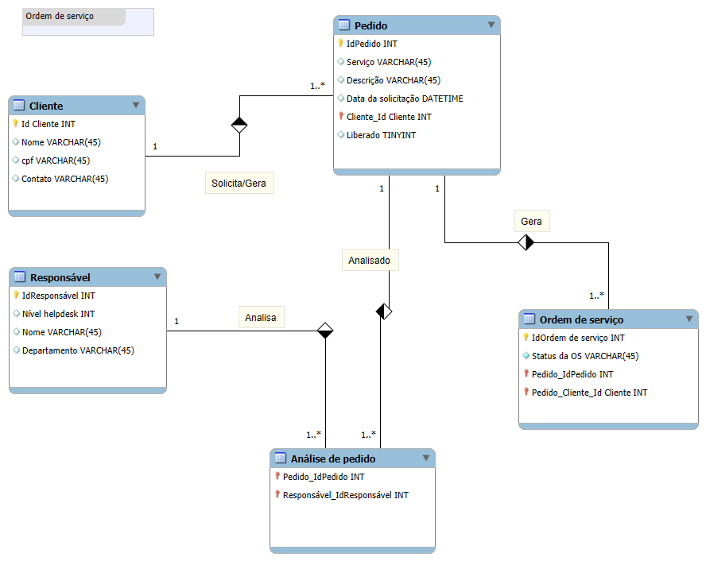

# Ordem de serviço — Esquema Conceitual



## Objetivo
Este repositório contém o **esquema conceitual** de um processo de *ordem de serviço*. O objetivo é documentar, em nível conceitual, como os dados são organizados e como as entidades se relacionam, servindo de base para modelagem lógica e implementação futura.

## Entidades e atributos
### Cliente
- **Id Cliente** *(INT)* — chave primária  
- **Nome** *(VARCHAR(45))*  
- **cpf** *(VARCHAR(45))*  
- **Contato** *(VARCHAR(45))*  

### Responsável
- **IdResponsável** *(INT)* — chave primária  
- **Nível helpdesk** *(INT)*  
- **Nome** *(VARCHAR(45))*  
- **Departamento** *(VARCHAR(45))*  

### Pedido
- **IdPedido** *(INT)* — chave primária  
- **Serviço** *(VARCHAR(45))*  
- **Descrição** *(VARCHAR(45))*  
- **Data da solicitação** *(DATETIME)*  
- **Cliente_Id Cliente** *(INT)* — *FK → Cliente.Id Cliente*  
- **Liberado** *(TINYINT)*  

### Análise de pedido
- **Pedido_IdPedido** *(INT)* — *FK → Pedido.IdPedido*  
- **Responsável_IdResponsável** *(INT)* — *FK → Responsável.IdResponsável*  

### Ordem de serviço
- **IdOrdem de serviço** *(INT)* — chave primária  
- **Status da OS** *(VARCHAR(45))*  
- **Pedido_IdPedido** *(INT)* — *FK → Pedido.IdPedido*  
- **Pedido_Cliente_Id Cliente** *(INT)* — *FK → Cliente.Id Cliente*  

## Relacionamentos e cardinalidades
- **Cliente _solicita/gera_ Pedido**: **1 : N** (um cliente pode gerar vários pedidos).  
- **Responsável _analisa_ Análise de pedido**: **1 : N** (um responsável pode realizar muitas análises).  
- **Pedido _é analisado_ por Análise de pedido**: **1 : N** (um pedido pode ter várias análises ao longo do tempo).  
- **Pedido _gera_ Ordem de serviço**: **1 : N** (um pedido pode gerar várias OS).  
- **Ordem de serviço** referencia **Pedido** e o **Cliente** daquele pedido para facilitar relatórios.

## Regras de negócio (derivadas do diagrama)
1. Um **Cliente** pode abrir vários **Pedidos**; cada **Pedido** pertence a um único **Cliente**.  
2. Um **Pedido** pode ser analisado múltiplas vezes por diferentes **Responsáveis**; cada registro em **Análise de pedido** vincula exatamente **um Pedido** a **um Responsável** (histórico de análises).  
3. Um **Pedido** pode gerar **zero ou mais** **Ordens de serviço**. Cada **OS** está sempre associada a **um único Pedido**.  
4. **Liberado (TINYINT)** indica se o **Pedido** está apto a gerar **Ordem de serviço**.  
5. **Pedido_Cliente_Id Cliente** na **Ordem de serviço** replica o cliente do pedido (denormalização controlada para consultas e relatórios).  

## Observações de modelagem
- **Integridade referencial**: FKs vinculam *Pedido → Cliente*, *Análise de pedido → (Pedido, Responsável)* e *OS → (Pedido, Cliente)*.  
- **Consistência**: a criação de uma **OS** deve ser bloqueada quando **Pedido.Liberado = 0**.  
- **Índices sugeridos**: `Pedido(Cliente_Id Cliente)`, `Analise de pedido(Pedido_IdPedido)`, `Analise de pedido(Responsável_IdResponsável)`, `Ordem de serviço(Pedido_IdPedido)`.

## Como visualizar o diagrama
O arquivo **Ordem.png** neste repositório contém o esquema conceitual exatamente como na imagem fornecida.  
Se desejar editar o desenho, recrie-o no [diagrams.net](https://app.diagrams.net/) e salve como **.drawio** (Arquivo → Salvar como…).


---

## Estrutura esperada do repositório
```
ordem-de-servico-conceitual/
├─ README.md
└─ Ordem.png
```

> **Dica**: sempre use nomes de arquivo sem espaços para facilitar referências no Markdown.

